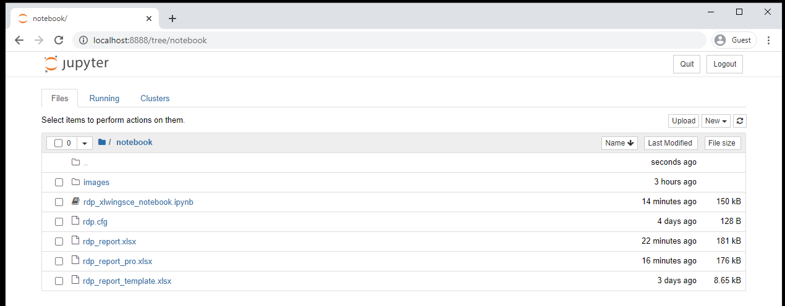
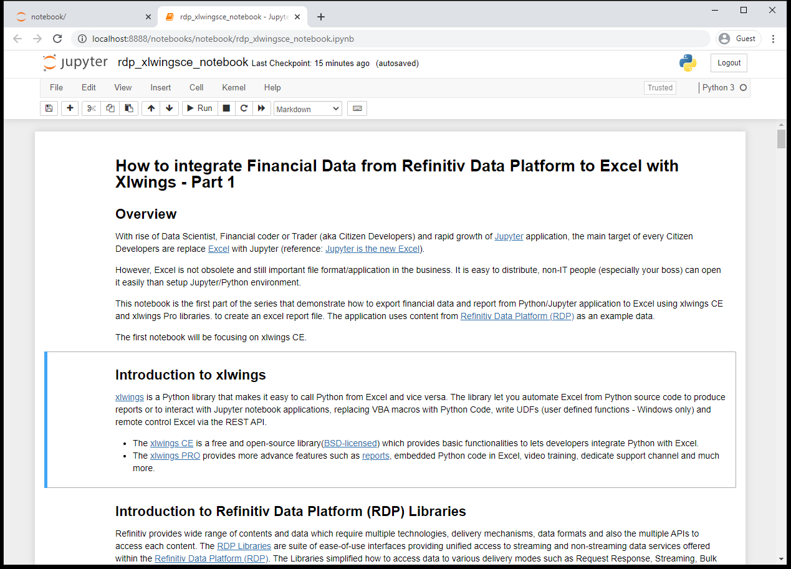
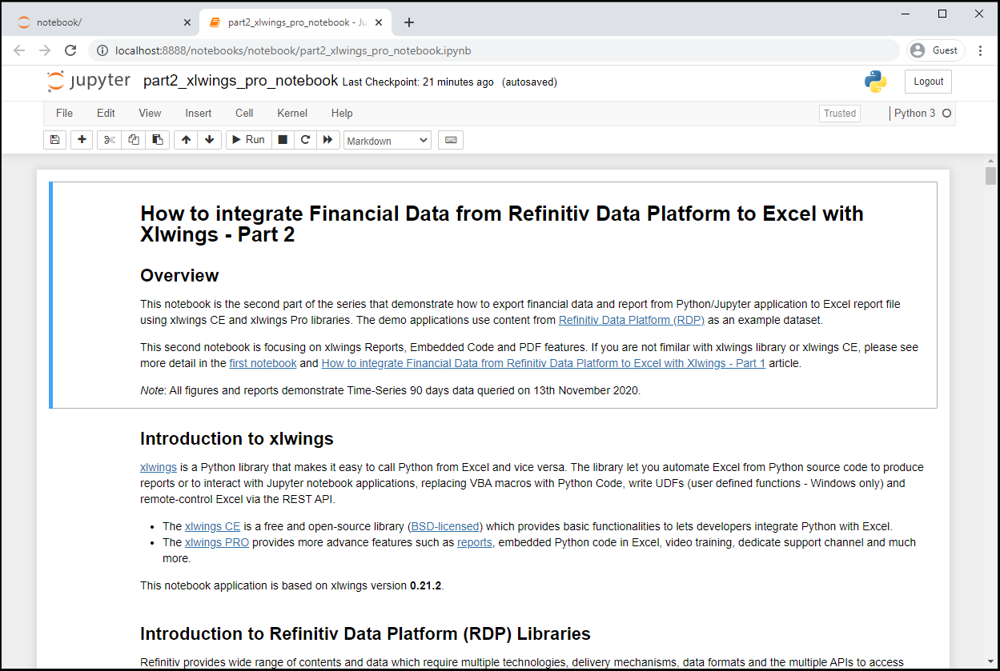

# How to integrate Financial Data from Refinitiv Data Platform to Excel with Xlwings
- version: 1.0
- Last update: October 2020
- Environment: Windows
- Prerequisite: [Access to RDP credentials](#prerequisite) and [xlwings](https://www.xlwings.org)

## <a id="overview"></a>Overview

With the rise of Data Scientist, Financial coder or, Trader (aka Citizen Developers) and rapid growth of [Jupyter](https://jupyter.org/) application, the main target of every Citizen Developers are replacing [Microsoft Excel](https://www.microsoft.com/en-us/microsoft-365/excel) with Jupyter application (reference: [Jupyter is the new Excel](https://towardsdatascience.com/jupyter-is-the-new-excel-a7a22f2fc13a)). 

However, Excel is not obsolete and still be an important file format/application in the business. It is easy to distribute and non-IT people (especially your boss) can open it easily than setup Jupyter/Python environment. 

This example project contains a series of Jupyter Notebook and Python console applications that demonstrate how to export financial data and report from Python/Jupyter application to Excel report file using xlwings CE and xlwings Pro libraries. The demo application uses content from [Refinitiv Data Platform (RDP)](https://developers.refinitiv.com/refinitiv-data-platform/refinitiv-data-platform-apis) as an example of data.

*Note*: 
- All figures and reports in the *rdp_xlwingsce_notebook.ipynb* notebook demonstrate Time-Series 90 days data queried on 14th October 2020.
- All figures and reports in the *part2_xlwings_pro_notebook.ipynb* notebook demonstrate Time-Series 90 days data queried on 13th November 2020.

## <a id="xlwings"></a>Introduction to xlwings

[xlwings](https://www.xlwings.org) is a Python library that makes it easy to call Python from Excel and vice versa on Windows and macOS. The library lets you automate Excel from Python source code to produce reports or to interact with Jupyter notebook applications. It also allows you to replace VBA macros with Python Code or write UDFs (user defined functions - Windows only).
* The [xlwings CE](https://docs.xlwings.org/en/stable) is a free and open-source library ([BSD-licensed](https://opensource.org/licenses/BSD-3-Clause)) which provides basic functionalities to lets developers integrate Python with Excel. 
* The [xlwings PRO](https://www.xlwings.org/pro) provides more advance features such as [reports](https://www.xlwings.org/reporting), embedded Python code in Excel, one-click installers for easy deployment, video training, dedicated support and much more. 

Please refer to [Financial Reporting with Eikon, xlwings and Excel](https://developers.refinitiv.com/en/article-catalog/article/financial-reporting-with-eikon-and-excel) article which give detail regarding how to integrate xlwings with other Refinitiv Python API.

## <a id="rdp_lib"></a>Introduction to Refinitiv Data Platform (RDP) Libraries

Refinitiv provides a wide range of contents and data which require multiple technologies, delivery mechanisms, data formats, and the multiple APIs to access each content. The [RDP Libraries](https://developers.refinitiv.com/en/api-catalog/refinitiv-data-platform/refinitiv-data-platform-libraries) are a suite of ease-of-use interfaces providing unified access to streaming and non-streaming data services offered within the [Refinitiv Data Platform (RDP)](https://developers.refinitiv.com/en/api-catalog/refinitiv-data-platform/refinitiv-data-platform-apis). The Libraries simplified how to access data to various delivery modes such as Request Response, Streaming, Bulk File, and Queues via a single library. 

For more deep detail regarding the RDP Libraries, please refer to the following articles and tutorials:
- [Developer Article: Discover our Refinitiv Data Platform Library part 1](https://developers.refinitiv.com/article/discover-our-upcoming-refinitiv-data-platform-library-part-1).
- [Developer Article: Discover our Refinitiv Data Platform Library part 2](https://developers.refinitiv.com/article/discover-our-upcoming-refinitiv-data-platform-library-part-2-0).
- [Refinitiv Data Platform Libraries Document: An Introduction page](https://developers.refinitiv.com/refinitiv-data-platform/refinitiv-data-platform-libraries/docs?content=62446&type=documentation_item).

### Disclaimer

As these articles are based on alpha versions 1.0.0.a5 and 1.0.0.a7 of the Python library, the method signatures, data formats, etc are subject to change.

## <a id="prerequisite"></a>Prerequisite
This demo project requires the following dependencies software.
1. RDP Access credentials.
2. [xlwings library](https://www.xlwings.org/) version 0.21.2 and above.
3. [Microsoft Excel](https://www.microsoft.com/en-us/microsoft-365/excel).
4. Python [Anaconda](https://www.anaconda.com/distribution/) or [MiniConda](https://docs.conda.io/en/latest/miniconda.html) distribution/package manager.
5. [Classic Jupyter Notebook application ](https://jupyter.org/).
6. Internet connection.

Please contact your Refinitiv's representative to help you to access Refinitiv Data Platform credentials. You can generate/manage the AppKey from the  [AppKeyGenerator web site](https://emea1.apps.cp.thomsonreuters.com/apps/AppkeyGenerator) or AppKey Generator tool in Eikon Desktop/Refinitiv Workspace application. 

## <a id="application_files"></a>Project Application Files
This example project contains the following files and folders
1. *notebook_python/rdp_xlwingsce_notebook.ipynb*: The example RDP Libraries - xlwings CE Jupyter Notebook application file.
2. *notebook_python/part2_xlwings_pro_notebook.ipynb*: The example RDP Libraries - xlwings PRO Jupyter Notebook application file.
3. *python_embedded/rdp_ipa_bond.py* and *python_embedded/rdp_ipa_bond.xlsm*: The example RDP Libraries - xlwings Embedded Code application files.
4. *requirements.txt*: The project xlwings CE dependencies configuration file.
5. *xlwingspro_requirements.txt*: The project xlwings PRO dependencies configuration file.
6. *images*: Project images folder.
7. *LICENSE.md*: Project's license file.
8. *README.md*: Project's README file.

## <a id="running"></a>Running the xlwings CE Notebook example.
1. Open Anaconda Prompt and go to project's folder
2. Run the following command in a Anaconda Prompt to create Conda environment named *xlwings_rdp* for the project.
    ```
    (base) $>conda create --name xlwings_rdp python=3.7
    ```
3. Once the environment is created, activate Conda environment named ```xlwings_rdp``` with this command in Anaconda Prompt
    ```
    (base) $>conda activate xlwings_rdp
    ```
4. Run the following command to install RDP Library for Python, xlwings CE and all dependencies in *xlwings_rdp* environment
    ```
    (xlwings_rdp) $>pip install -r requirements.txt
    ```
5. Go to project's notebook folder and create a file name ```rdp.cfg``` with the following content
    ```
    [rdp]
    username = YOUR_RDP_USERNAME
    password = YOUR_RDP_PASSWORD
    app_key = YOUR_RDP_APP_KEY
    ```

    Please note that you *do not* need the ```""``` or ```''``` characters for a string value as the following example:

    ```
    [rdp]
    username=example@email.com
    password=$$example_password%%
    app_key=bbb_example_client_id_ccc
    ```

6. In the current Anaconda Prompt, go to project's notebook folder. Run the following command to start classic Jupyter Notebook in the notebook folder.
    ```
    (xlwings_rdp) $>notebook>jupyter notebook
    ```
7. Jupyter Notebook will open the web browser and open the notebook home page.

     
8. Open *rdp_xlwingsce_notebook.ipynb* Notebook document, then follow through each notebook cell.

     

## <a id="running_pro"></a>Running the xlwings PRO Notebook example.
1. Open Anaconda Prompt and go to project's folder
2. Run the following command in a Anaconda Prompt to create Conda environment named *xlwings_rdp* for the project.
    ```
    (base) $>conda create --name xlwingspro_rdp python=3.7
    ```
3. Once the environment is created, activate Conda environment named ```xlwings_rdp``` with this command in Anaconda Prompt
    ```
    (base) $>conda activate xlwingspro_rdp
    ```
4. Run the following command to install RDP Library for Python, xlwings CE and all dependencies in *xlwings_rdp* environment
    ```
    (xlwingspro_rdp) $>pip install -r xlwingspro_requirements
    ```
5. Follow the same steps as [Running the xlwings CE Notebook example](#running) to open Jupyter Notebook in the web browser.
6. Open *part2_xlwings_pro_notebook.ipynb* Notebook document, then follow through each notebook cell.
     

## <a id="running_embedded"></a>Running the xlwings Embedded Code example.
1. Setup *xlwingspro_rdp* environment as the steps in [Running the xlwings PRO Notebook example](#running_pro)
2. Open *python_embedded* folder and follow through the [README.md](./python_embedded/README.md) file in the folder.

## <a id="conclusion"></a>Conclusion and Next Step

The xlwings CE library lets Python developers integrate data with Excel in a simple way. The library is suitable for a wide range of developers from casual coders, data scientists, professional traders to seasoned programmers, and allows them to work on data analysis and generate reports based on their skill. 

The newly introduced xlwings CCE ```to_pdf``` feature also lets developers export the Excel Workbook/Sheets to the PDF file. This function helps business users who do not have [Microsoft Office](https://www.office.com/) installed can still be able to open the PDF report file.

The xlwings PRO Reports and Embedded Code features allow Python developers and business users to work together to integrate data to Excel report file much easier than xlwings CE.

The xlwings Reports help businesses and financial teams design the report to match their business requirement freely. The Python developers/data engineers can focus on how to retrieve and optimize data without no need to worry about report design. xlwings Reports also help developers can automate report generator process periodicity (such as a daily, weekly, or monthly report).

If users want dynamic data and charts in the report file, the xlwings Embedded Code feature lets users run Python code in the macro-enabled Excel report directly. Users do not need to run a separate Python code themselves or wait for Developers to generate a report file for them.

At the same time, the [Refinitiv Data Platform (RDP) Libraries](https://developers.refinitiv.com/refinitiv-data-platform/refinitiv-data-platform-libraries) let developers rapidly access Refinitiv Platform content with a few lines of code that easy to understand and maintain. Developers can focus on implement the business logic or analysis data without worry about the connection, authentication detail with the Refinitiv Platforms.

The integration between Refinitiv APIs and xlwings is not limited to only RDP Libraries. Any [Refinitiv APIs](https://developers.refinitiv.com/en/api-catalog?i=1;q1=page-type%3Aapi;q2=devportal%3Alanguages~2Fpython;sort=title;sp_c=12;sp_cs=UTF-8;sp_k=devportal-prod;view=xml;x1=w-page-type-id;x2=api-language) that support Python programming language such as [Eikon Data API](https://developers.refinitiv.com/en/api-catalog/eikon/eikon-data-api) ([Eikon Data API-xlwings article](https://developers.refinitiv.com/en/article-catalog/article/financial-reporting-with-eikon-and-excel)), or [RKD API](https://developers.refinitiv.com/en/api-catalog/refinitiv-knowledge-direct/refinitiv-knowledge-direct-api-rkd-api), or [DataStream Web Service - Python](https://developers.refinitiv.com/en/api-catalog/eikon/datastream-web-service/) can work with xlwings library using the same concept and code logic as this RDP Libraries notebook example.

<!-- ACKNOWLEDGEMENTS -->
## <a id="acknowledgements"></a>Acknowledgements

Thank you [Felix Zumstein (@fzumstein)](https://github.com/fzumstein) from [xlwings](https://www.xlwings.org/) for your contribution, code and content review and your support.

## <a id="references"></a>References

You can find more details regarding the Refinitiv Data Platform Libraries, xlwings and, related technologies for this notebook from the following resources:
* [Refinitiv Data Platform (RDP) Libraries](https://developers.refinitiv.com/en/api-catalog/refinitiv-data-platform/refinitiv-data-platform-libraries) on the [Refinitiv Developer Community](https://developers.refinitiv.com/) web site.
* [Xlwings web site](https://www.xlwings.org/).
* [Xlwings CE Document page](https://docs.xlwings.org/en/stable/).
* [xlwings PRO page](https://www.xlwings.org/pro).
* [xlwings PRO Document page](https://docs.xlwings.org/en/stable/pro.html).
* [xlwings API Reference page](https://docs.xlwings.org/en/stable/api.html).
* [xlwings Reports page](https://www.xlwings.org/reporting).
* [xlwings Embedded Code page](https://docs.xlwings.org/en/stable/deployment.html#embedded-code).
* [Financial Reporting with Eikon, xlwings and Excel](https://developers.refinitiv.com/en/article-catalog/article/financial-reporting-with-eikon-and-excel).
* [RDP Libraries Quick Start Guide page](https://developers.refinitiv.com/en/api-catalog/refinitiv-data-platform/refinitiv-data-platform-libraries/quick-start).
* [RDP Libraries Tutorial page](https://developers.refinitiv.com/en/api-catalog/refinitiv-data-platform/refinitiv-data-platform-libraries/tutorials).
* [Discover our Refinitiv Data Platform Library (part 1)](https://developers.refinitiv.com/en/article-catalog/article/discover-our-refinitiv-data-platform-library-part-1).
* [Discover our Refinitiv Data Platform Library (part 2)](https://developers.refinitiv.com/en/article-catalog/article/discover-our-refinitiv-data-platform-library-part-2).

For any questions related to this article or Refinitiv Data Platform Libraries, please use the Developers Community [Q&A Forum](https://community.developers.refinitiv.com/spaces/321/refinitiv-data-platform-libraries.html).
