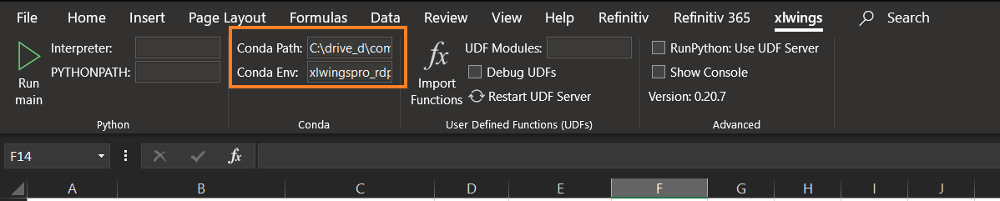

# How to run xlwings PRO Embedded Code

## Overview

The [xlwings PRO Embedded Code](https://docs.xlwings.org/en/stable/deployment.html#embedded-code) allows you to store your Python code directly in Excel so you don’t have to distribute separate Python files.

## Prerequisite
1. RDP Access credentials.
2. [Microsoft Excel](https://www.microsoft.com/en-us/microsoft-365/excel).
3. Python [Anaconda](https://www.anaconda.com/distribution/) or [MiniConda](https://docs.conda.io/en/latest/miniconda.html) distribution/package manager.
4. [xlwings PRO](https://www.xlwings.org/pro) license.
5. Enable xlwings VBA addin/Run Main for Excel 
5. Internet connection.

## How to enable xlwings VBA addin/Run Main for Excel 

Please follow the following steps to set up xlwings VBA macro before proceed the code.
1. https://docs.xlwings.org/en/stable/addin.html#xlwings-addin
2. https://docs.xlwings.org/en/stable/vba.html#runpython

Please make sure that your Excel file has set a correct Python or Conda environment. 

 

## How to enable xlwings PRO license

Please follow the step in this https://docs.xlwings.org/en/stable/installation.html#how-to-activate-xlwings-pro page.


## Steps to run:
1. Go to project's notebook folder and create a file name ```rdp.cfg``` with the following content
    ```
    [rdp]
    username = YOUR_RDP_USERNAME
    password = YOUR_RDP_PASSWORD
    app_key = YOUR_RDP_APP_KEY
    ```

    Please note that you *do not* need the ```""``` or ```''``` characters for a string value as the following example:

    ```
    [rdp]
    username=example@email.com
    password=$$example_password%%
    app_key=bbb_example_client_id_ccc
    ```

2. Back python_embedded folder and open *rdp_ipa_bond.py* file and change the following line to be an absolute path of your rdp.cfg file.
    ```
    cfg_location = '<your machine folder>' + '\\rdp.cfg' # Change it to match your machine folder.
    ```
3. Open a terminal/command prompt to this *python_embedded* folder.
4. Open "rdp_ipa_bond.xlsm" file.
5. Then, run the ```xlwings code embed``` command in the terminal.
6. Once this python code is loaded to rdp_ipa_bond.xlsm file as a new sheet, click xlwings --> Run main in Excel toolbar