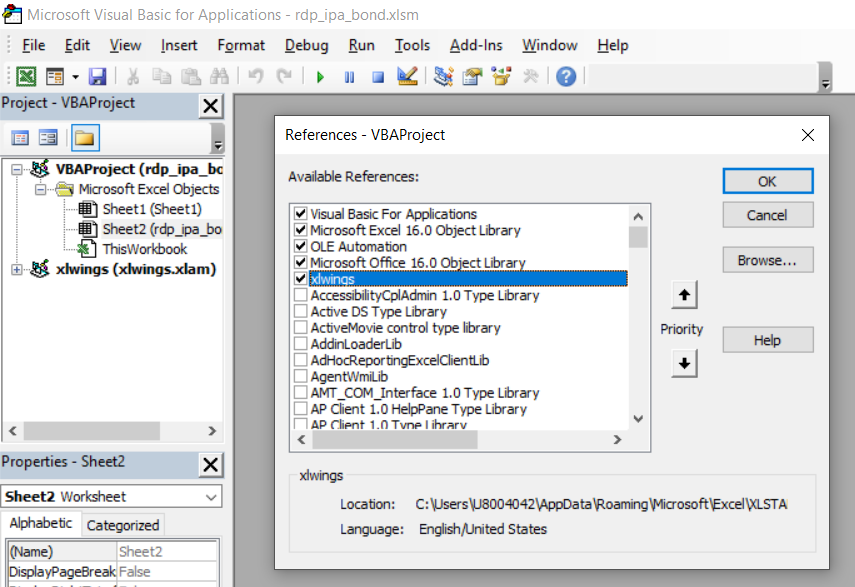

# How to run xlwings PRO Embedded Code

## Overview

The [xlwings Embedded Code](https://docs.xlwings.org/en/stable/deployment.html#embedded-code) is part of [xlwings PRO ](https://www.xlwings.org/pro). It allows you to store your Python code directly in Excel so you don’t have to distribute separate Python files.

## Prerequisite
1. RDP Access credentials.
2. [Microsoft Excel](https://www.microsoft.com/en-us/microsoft-365/excel).
3. Python [Anaconda](https://www.anaconda.com/distribution/) or [MiniConda](https://docs.conda.io/en/latest/miniconda.html) distribution/package manager.
4. [xlwings PRO](https://www.xlwings.org/pro) license.
5. Enable xlwings VBA addin/Run Main for Excel 
5. Internet connection.

## How to setup xlwingspro_rdp Conda environment
1. Open Anaconda Prompt and go to project's folder
2. Run the following command in a Anaconda Prompt to create Conda environment named *xlwings_rdp* for the project.
    ```
    (base) $>conda create --name xlwingspro_rdp python=3.7
    ```
3. Once the environment is created, activate Conda environment named ```xlwings_rdp``` with this command in Anaconda Prompt
    ```
    (base) $>conda activate xlwingspro_rdp
    ```
4. Run the following command to install RDP Library for Python, xlwings CE and all dependencies in *xlwings_rdp* environment
    ```
    (xlwingspro_rdp) $>pip install -r xlwingspro_requirements
    ```

## How to enable xlwings VBA addin/Run Main for Excel 

Please follow the following steps to set up xlwings add-in before proceed the code.
1. https://docs.xlwings.org/en/stable/addin.html#xlwings-addin
2. https://docs.xlwings.org/en/stable/addin.html#run-main

Please make sure that your Excel file has enable xlwings add-in and set a correct Python or Conda environment. 

 

 

Alternatively, you can replace xlwings Add-in with a VBA module which let you run embedded Python code from VBA function ```RunPython ("import mymodule;mymodule.myfunction()")``` without to install the add-in. Please see more detail in [xlwings add-in: RunPython quickstart example](https://docs.xlwings.org/en/stable/vba.html#xlwings-add-in) page.

## How to enable xlwings PRO license

Please follow the step in this https://docs.xlwings.org/en/stable/installation.html#how-to-activate-xlwings-pro page.


## Steps to run:
1. Go to project's notebook folder and create a file name ```rdp.cfg``` with the following content
    ```
    [rdp]
    username = YOUR_RDP_USERNAME
    password = YOUR_RDP_PASSWORD
    app_key = YOUR_RDP_APP_KEY
    ```

    Please note that you *do not* need the ```""``` or ```''``` characters for a string value as the following example:

    ```
    [rdp]
    username=example@email.com
    password=$$example_password%%
    app_key=bbb_example_client_id_ccc
    ```

2. Back to *python_embedded* folder and open *rdp_ipa_bond.py* file, then change the following line to be an absolute path of your rdp.cfg file.
    ```
    cfg_location = '<your machine folder>' + '\\rdp.cfg' # Change it to match your machine folder.
    ```
3. Open a Anaconda Prompt to this *python_embedded* folder.
4. Activate Conda environment.
    ```
    (base) $>conda activate xlwingspro_rdp
    ```
4. Open "rdp_ipa_bond.xlsm" file.
5. Then, run the ```xlwings code embed``` command in the a Anaconda Prompt.
    ```
    (xlwingspro_rdp) $>xlwings code embed
    ```
6. Once this python code is loaded to rdp_ipa_bond.xlsm file as a new sheet, click xlwings --> Run main in Excel toolbar